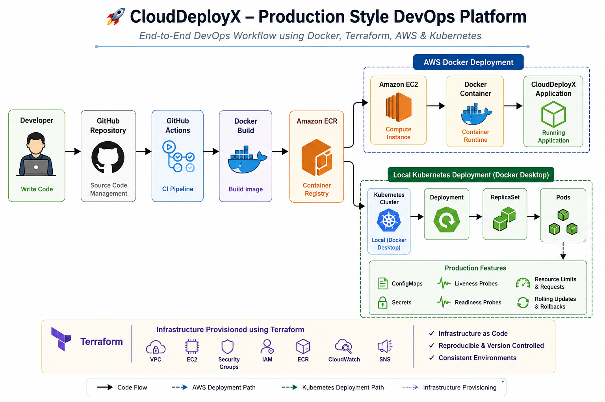

# 🚀 CloudDeployX

> **A production-style DevOps project demonstrating containerization, Infrastructure as Code, CI/CD automation, and Kubernetes orchestration using industry-standard tools.**

CloudDeployX was built to simulate how a modern application moves from source code to deployment using Docker, GitHub Actions, Terraform, AWS, and Kubernetes while following production best practices.

---

# 📖 Project Overview

The goal of this project was not to build another demo application, but to understand and implement the complete DevOps lifecycle.

The project demonstrates:

- Containerization using Docker
- Infrastructure provisioning using Terraform
- CI/CD automation using GitHub Actions
- Docker image management using Amazon ECR
- AWS-based Docker deployment
- Kubernetes deployment with production best practices
- Configuration management using ConfigMaps and Secrets
- Application health monitoring using Liveness & Readiness Probes
- Resource management using Requests & Limits
- Zero-downtime deployments using Rolling Updates

> **Note**
>
> This project demonstrates two deployment environments:
>
> - AWS Docker Deployment
> - Local Kubernetes Deployment (Docker Desktop Kubernetes)

---

# 🏗 Architecture

The following diagram provides a high-level overview of the CloudDeployX platform, illustrating both the AWS Docker deployment and the local Kubernetes deployment used during development and learning.

<p align="center">
  
</p>

```text
Developer
     │
Git Push
     │
GitHub
     │
GitHub Actions
     │
Docker Build
     │
Amazon ECR
     │
───────────────
Deployment 1
AWS EC2
Docker Container
───────────────

Deployment 2

Docker Desktop Kubernetes

Deployment
ReplicaSet
Pods
Service
Ingress
Browser
```

---

# ⚙ Tech Stack

| Category | Technologies |
|-----------|--------------|
| Language | Python (FastAPI) |
| Containerization | Docker |
| Cloud | AWS |
| Infrastructure as Code | Terraform |
| CI/CD | GitHub Actions |
| Container Registry | Amazon ECR |
| Orchestration | Kubernetes |
| Version Control | Git & GitHub |
| Operating System | Linux |

---

# ✨ Features

- ✅ Dockerized Python Application
- ✅ Infrastructure as Code using Terraform
- ✅ Automated CI Pipeline using GitHub Actions
- ✅ Docker Image Push to Amazon ECR
- ✅ Kubernetes Deployment
- ✅ ReplicaSets
- ✅ Services
- ✅ Ingress
- ✅ ConfigMaps
- ✅ Secrets
- ✅ Liveness Probes
- ✅ Readiness Probes
- ✅ Resource Requests & Limits
- ✅ Rolling Updates
- ✅ Rollbacks

---

# ☁ AWS Deployment Flow

```
Developer

↓

Git Push

↓

GitHub Actions

↓

Docker Build

↓

Amazon ECR

↓

EC2 Instance

↓

Docker Container

↓

CloudDeployX
```

---

# ☸ Kubernetes Deployment Flow

```
Browser

↓

Ingress

↓

Service

↓

Deployment

↓

ReplicaSet

↓

Pods

↓

CloudDeployX

│

├── ConfigMap

├── Secret

├── Liveness Probe

├── Readiness Probe

└── Resource Limits
```

---

# 📁 Repository Structure

```
clouddeployx_devops/

├── app/
├── kubernetes/
├── terraform/
├── docs/
├── screenshots/
├── .github/workflows/
├── Dockerfile
├── requirements.txt
├── README.md
└── .gitignore
```

---

# 📸 Project Screenshots

The repository contains screenshots demonstrating:

- GitHub Actions Pipeline
- Amazon ECR Repository
- Terraform Apply
- Terraform State
- Application Load Balancer
- CloudWatch Alarm
- SNS Notification
- Target Group

---

# 🚀 How to Run

## Docker

```bash
docker build -t clouddeployx:v1 .
docker run -p 8000:8000 clouddeployx:v1
```

---

## Kubernetes

```bash
kubectl apply -f configmap.yaml
kubectl apply -f secret.yaml
kubectl apply -f deployment.yaml
kubectl apply -f service.yaml
kubectl apply -f ingress.yaml
```

---

## Terraform

```bash
terraform init
terraform plan
terraform apply
```

---

# 📚 Lessons Learned

Through this project I gained practical experience with:

- Designing production-style containerized applications
- Infrastructure as Code using Terraform
- CI/CD automation using GitHub Actions
- Docker image management using Amazon ECR
- Kubernetes Deployments and ReplicaSets
- Services and Ingress
- ConfigMaps and Secrets
- Health Probes
- Resource Requests & Limits
- Rolling Updates & Rollbacks

---

# 🔮 Future Improvements

- Deploy Kubernetes on Amazon EKS
- Helm Charts
- ArgoCD for GitOps
- Prometheus & Grafana Monitoring
- Horizontal Pod Autoscaler
- Multi-Environment Deployments (Dev, Stage, Production)

---

# 👨‍💻 Author

**Priyanshu Gairola**

Infrastructure Engineer transitioning into Cloud & DevOps Engineering.

Always learning. Always building.